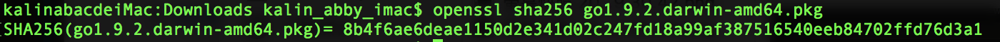
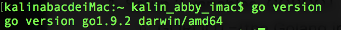
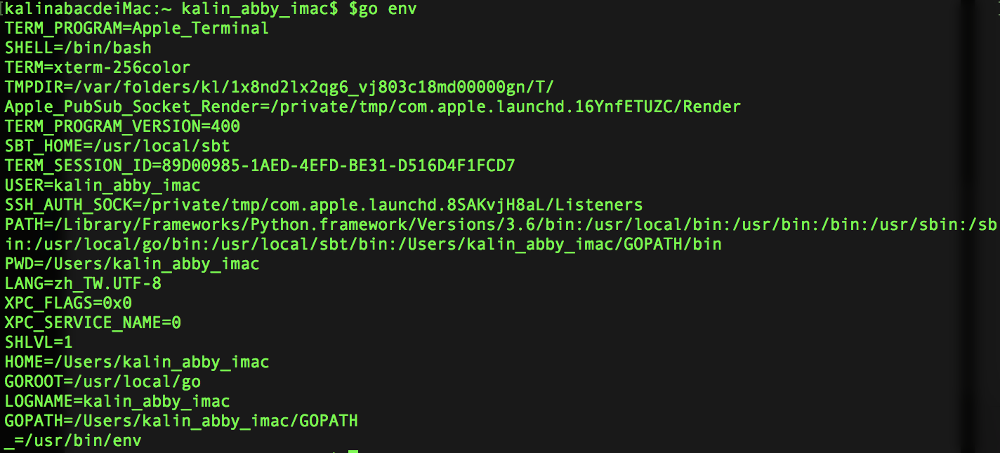

Setup Golang Programming Environment
===

- [Setup Golang Programming Environment](#setup-golang-programming-environment)
    - [Write Hello World on Go Playground](#write-hello-world-on-go-playground)
        - [Practice - Change the package name](#practice---change-the-package-name)
        - [Practice - Print current date](#practice---print-current-date)
    - [Download Golang & Install](#download-golang-install)
    - [Setup Environment Variables](#setup-environment-variables)
    - [Know the Workspace](#know-the-workspace)
    - [GoDoc](#godoc)
        - [https://golang.org/pkg](#httpsgolangorgpkg)
        - [https://godoc.org](#httpsgodocorg)
            - [Practice - Find & Download a 3rd Party Library](#practice---find-download-a-3rd-party-library)


Write Hello World on Go Playground
---
Open [Go playground](https://play.golang.org/) on web browser and click "Run". 

Try:
- Run
- Format
- Share


### Practice - Change the package name
```
package hello

import (
	"fmt"
)

func main() {
	fmt.Println("Hello, playground")
}
```
- Exception occurs when clicking Run: package name must be main

### Practice - Print current date
```
package main

import (
	"fmt"
	"time"
)

func main() {
	fmt.Println("Hello, playground")
	fmt.Println(time.Now())
}
 
```
> See Also: 
>    - [A Tour of Go](https://tour.golang.org/welcome/1)
>    - [Inside the Go Playground](https://blog.golang.org/playground)


Download Golang & Install
---
1. [Download Golang](https://golang.org/dl/) 
2. Verify the download by comparing the SHA256 Checksum
    - By command: openssl sha256 {the download} (for Mac & Unix)
    - Example: 
    - For Windows, install the [Github Desktop](https://desktop.github.com/) and run openssl on the "Git Bash"
3. Install 
4. Verify Installation
    - By command: **go version**
    - Example: 


Setup Environment Variables
---
1. Setup three variables:
    - **GOROOT**={the Golang installation directory}
    - **GOPATH**={the Golang workspace directory}
        - The default workspace is:
            - $HOME/go on Unix & Mac
            - %USERPROFILE%\go (usually C:\Users\YourName\go) on Windows
        - Contains 3 directories
            - src: contains Go source files,
            - pkg: contains package objects, and
            - bin: contains executable commands.
    - **PATH**
        - $PATH:$GOPATH/bin (on Mac $HOME/.bash_profile) 
2. Verify Environment Variables
- By command: **go env**
- Example: 


Know the Workspace
---

- Go programmers typically keep all their Go code in a single workspace.
- A workspace contains many version control repositories (managed by Git, for example).
- Each repository contains one or more packages.
- Each package consists of one or more Go source files in a single directory.
- The path to a package's directory determines its import path.
> Note that this differs from other programming environments in which every project has a separate workspace and workspaces are closely tied to version control repositories.


Example:
```
bin/
    hello                             # command executable
pkg/
    linux_amd64/
        github.com/golang/example/stringutil.a              # package object
src/
    github.com/golang/example/
        .git/                         # Git repository metadata
    hello/
        hello.go                      # command source
    stringutil/
        reverse.go                    # package source
        reverse_test.go               # test source
```

> Reference:
> - [Golang Code organization](https://golang.org/doc/code.html#Organization)


GoDoc
---

### https://golang.org/pkg

This is the Golang official document site. 

It lists the standard packages and source codes.

Examples:

- Package: https://golang.org/pkg/fmt/
- Source code: https://golang.org/src/fmt/ 

### https://godoc.org

GoDoc hosts documentation for Go packages on Bitbucket, GitHub, Launchpad and Google Project Hosting.

The source code for GoDoc is available on GitHub.

Examples:
- https://godoc.org/fmt 
- https://godoc.org/github.com/satori/go.uuid 

#### Practice - Find & Download a 3rd Party Library
1. Run "**go get** github.com/satori/go.uuid" on terminal
2. Check if the "github.com/satori" was downloaded in these directories:
    - $GOPATH/src/
    - $GOPATH/pkg/


