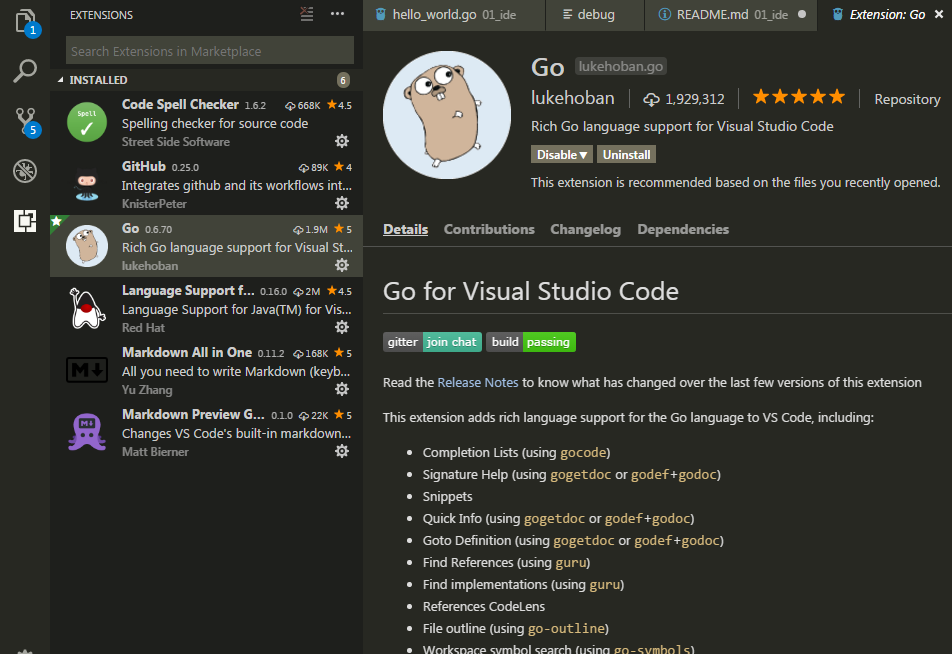
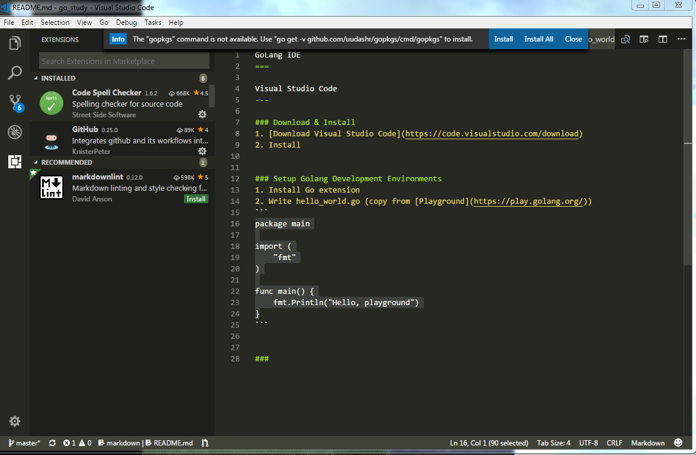
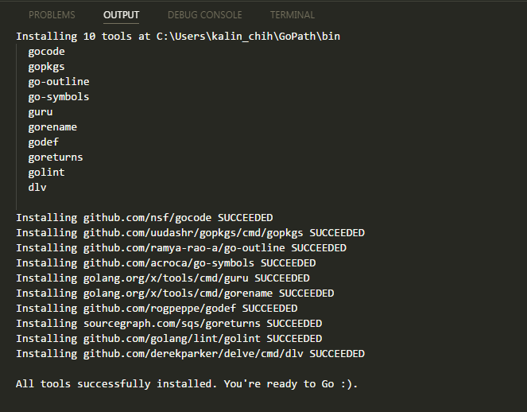
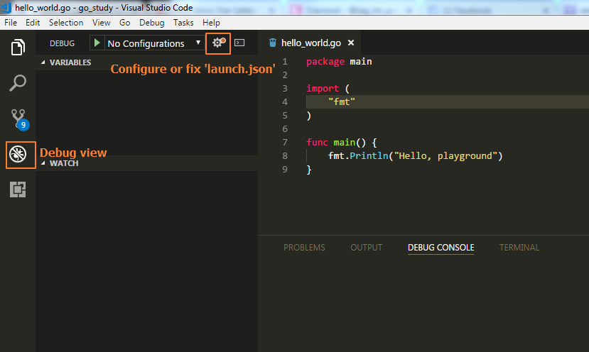
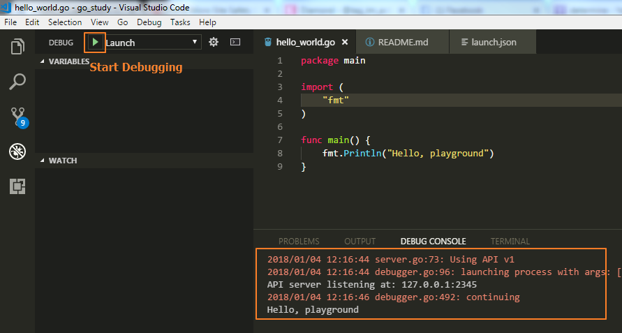
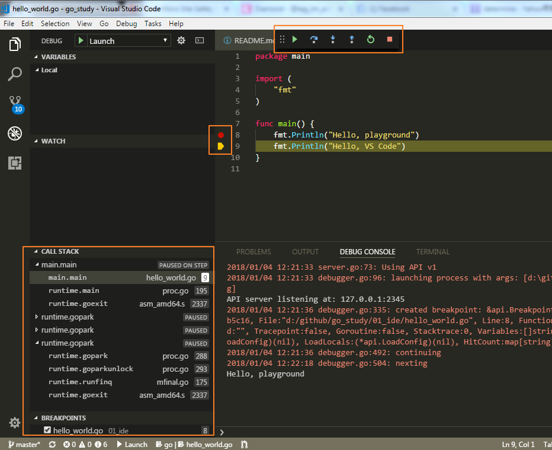
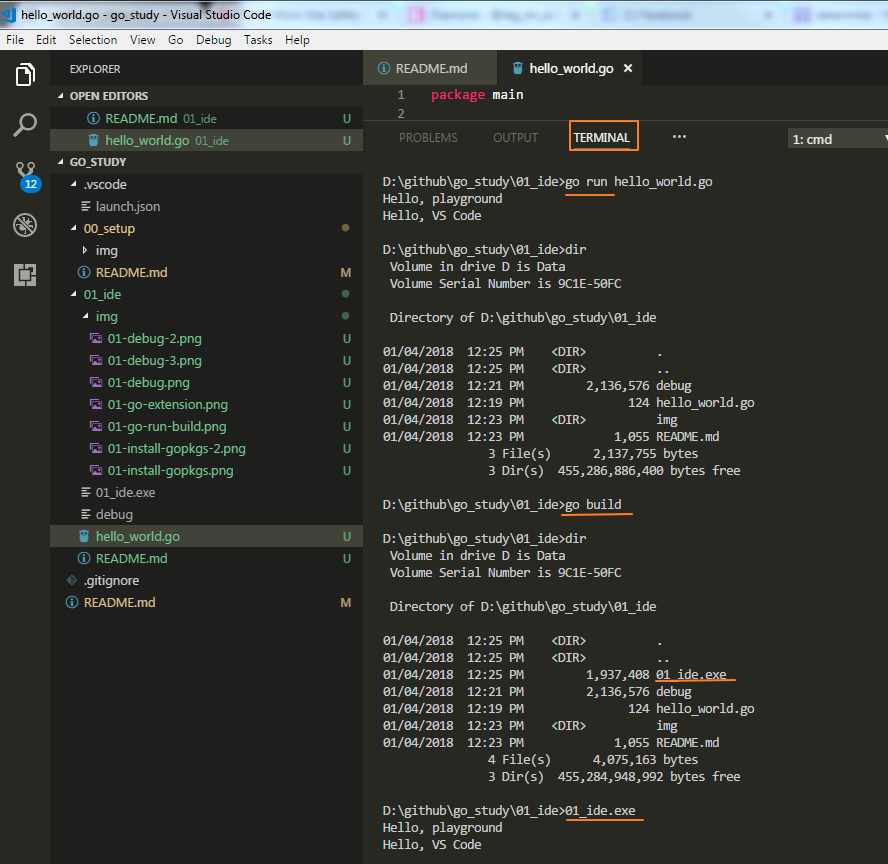

GoLang IDE
===

- [GoLang IDE](#golang-ide)
    - [Visual Studio Code](#visual-studio-code)
        - [Download & Install](#download-install)
        - [Setup Golang Development Environments](#setup-golang-development-environments)
        - [Go common commands on Terminal](#go-common-commands-on-terminal)
            - [**go run**](#go-run)
            - [**go build**](#go-build)
            - [**go clean**](#go-clean)
            - [**go install**](#go-install)
            - [**go help or go help [command]**](#go-help-or-go-help-command)


Visual Studio Code
---

### Download & Install
1. [Download Visual Studio Code](https://code.visualstudio.com/download)
2. Install


### Setup Golang Development Environments
1. Install Go extension

2. Create hello_world.go file (copy from [Playground](https://play.golang.org/))
> Add fmt.Println("Hello, VS Code") in func main()
```
package main

import (
	"fmt"
)

func main() {
	fmt.Println("Hello, playground")
	fmt.Println("Hello, VS Code")
}
```
3. After hello_world.go is created, VS code prompts "install gopks" tools. Click **Install All**.



> (For Mac) If encounter this exception during the installation,
> 	```
> 	xcrun: error: invalid active developer path (/Library/Developer/CommandLineTools), 
> 	missing xcrun at: /Library/Developer/CommandLineTools/usr/bin/xcrun
> ```
> Install XCode to fix it
> - xcode-select --install


4. Setup Debug
- Open Debug view and click **Configure or fix 'launch.json'**

- Click **Start Debugging** to view the debug result

5. Add a breakpoint on the fmt.Println("Hello, playground") and degub again to verify the breakpoint function



### Go common commands on Terminal
#### **go run**
Run compiles and runs the main package comprising the named Go source files.
A Go source file is defined to be a file ending in a literal ".go" suffix.


#### **go build**
Build compiles the packages named by the import paths,
along with their dependencies, but it does not install the results.

If the arguments to build are a list of .go files, build treats
them as a list of source files specifying a single package.

When compiling a single main package, build writes
the resulting executable to an output file named after
the first source file ('go build ed.go rx.go' writes 'ed' or 'ed.exe')
or the source code directory ('go build unix/sam' writes 'sam' or 'sam.exe').
The '.exe' suffix is added when writing a Windows executable.

When compiling multiple packages or a single non-main package,
build compiles the packages but discards the resulting object,
serving only as a check that the packages can be built.

When compiling packages, build ignores files that end in '_test.go'.

#### **go clean**
Clean removes object files from package source directories.
The go command builds most objects in a temporary directory,
so go clean is mainly concerned with object files left by other
tools or by manual invocations of go build.

#### **go install**
Install compiles and installs the packages named by the import paths,
along with their dependencies.


#### **go help or go help [command]**
Show the command help document